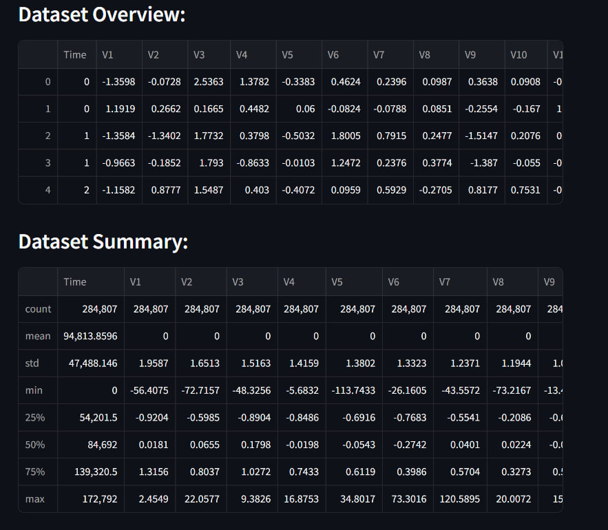
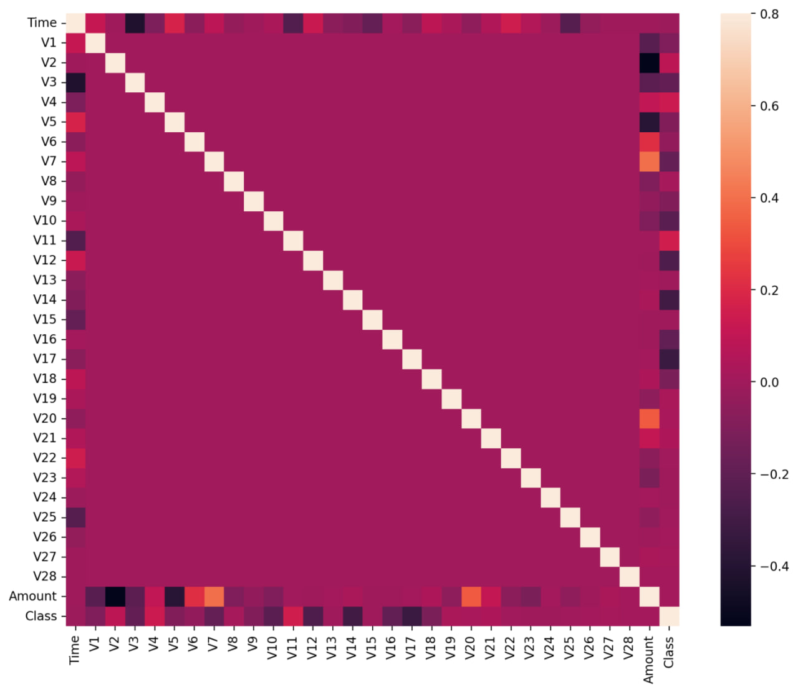
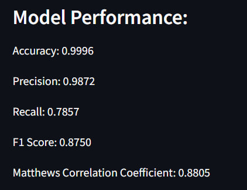
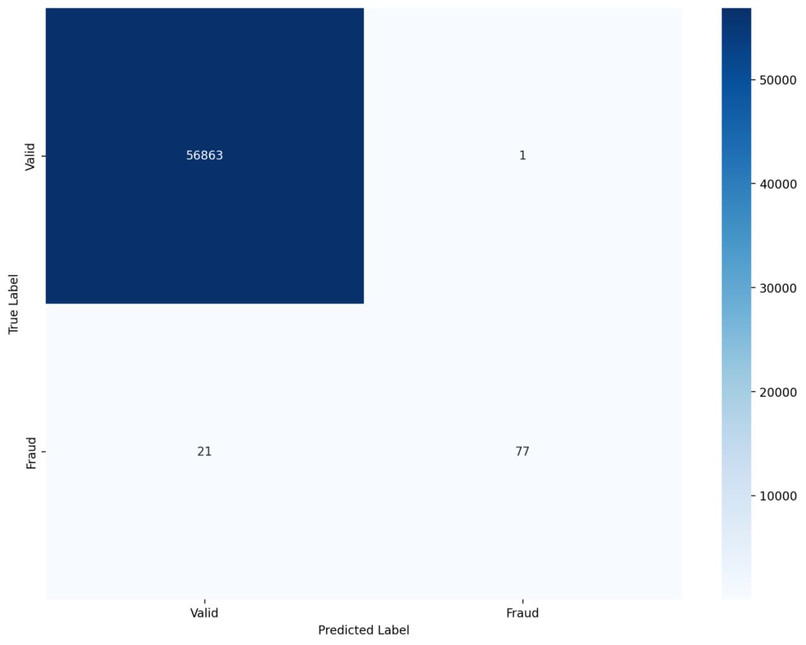
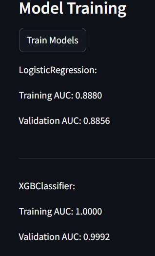

# FraudGuard
## Introduction
FraudGuard is an AI-powered fraud detection application developed to identify and prevent fraudulent transactions in real time. This application uses various machine learning algorithms to classify transactions as legitimate or fraudulent, providing detailed insights and performance metrics. Built with Streamlit, FraudGuard offers an intuitive interface for analyzing credit card and online payment fraud.

## Features
- Credit Card Fraud Detection: Load and analyze a dataset to detect fraudulent transactions using Random Forest, displaying insights such as fraud vs. valid transaction statistics and correlation matrix.

- Online Payment Fraud Detection: Detect fraud in online payment data using Logistic Regression, XGBoost, Support Vector Machine, and Random Forest. The app optimizes memory usage for large datasets, ensuring efficient processing.

## How It Works
1. Credit Card Fraud Detection
- Data Upload: Upload a CSV file containing credit card transactions.

- Data Overview: View the first few rows, descriptive statistics, and details on fraud vs. valid transactions.

- Correlation Matrix: Visualize feature correlations.

- Model Training: Train a Random Forest model and view performance metrics including accuracy, precision, recall, F1 score, and Matthews Correlation Coefficient.

- Confusion Matrix: Visualize the confusion matrix to see the model's predictions.

2. Online Payment Fraud Detection
- Data Upload: Upload a CSV file for online payment fraud detection.
- Data Preprocessing: The application optimizes memory usage and creates dummy variables for categorical features.
- Data Visualization: Visualize the data distribution and correlation heatmap.

- Model Training: Train and compare multiple models (Logistic Regression, XGBoost, SVM, Random Forest) on AUC scores.

- Model Evaluation: Generate a confusion matrix for the XGBoost model to assess prediction accuracy.

## Requirements
- Python 3.7 or above
- Streamlit
- Pandas
- NumPy
- Scikit-learn
- Seaborn
- Matplotlib
- XGBoost
